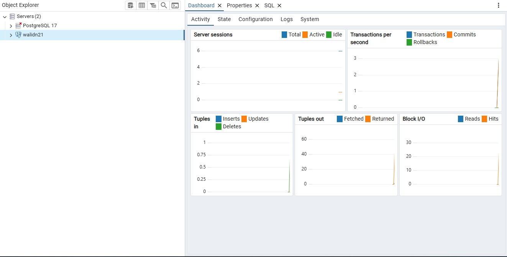
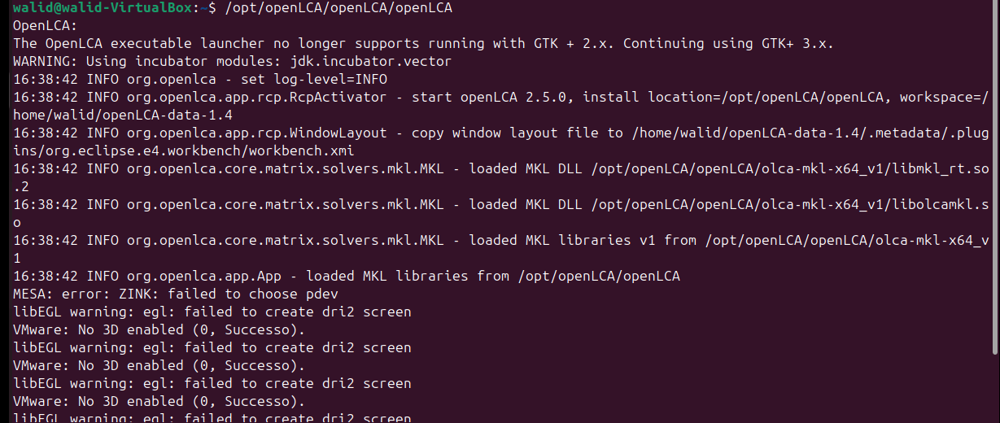
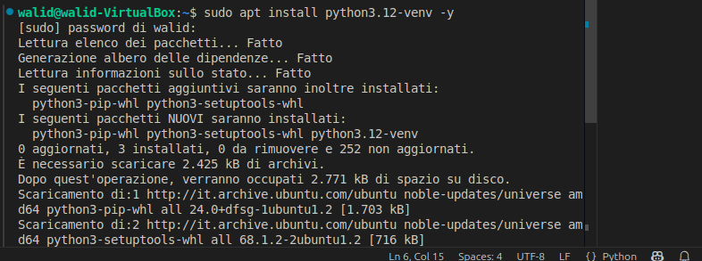
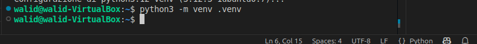
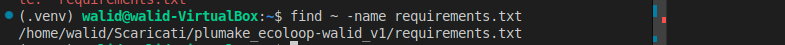
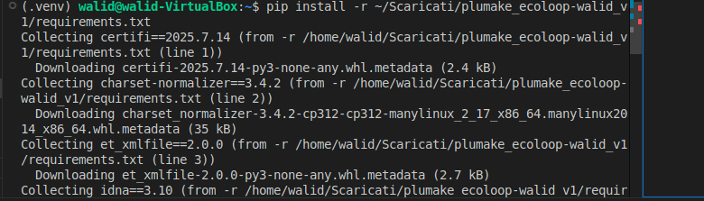

# plumake_ecoloop

SOLO SU UBUNTU 24.04 
Questo programma Python si collega al database di **OpenLCA**, esegue i calcoli degli **impatti ambientali** per ogni processo presente, e salva automaticamente tutti i risultati in un database **PostgreSQL**.

In particolare, importa i dati relativi ai processi (come quelli dei database *Ecoinvent* o *Agribalyse*), li elabora tramite OpenLCA e memorizza i valori calcolati (come il *Global Warming Potential*, l’uso di energia, ecc.) nel database per poterli visualizzare, analizzare o esportare.


sviluppato da Isuru Fernando e Walid Jebali

## Instruzioni


- [Installare sudo apt update && upgrade + Python 3](#installare-sudo-apt-update--upgrade--python-3)
- [Installazione Postgresql + pgADMIN4 ](#installazione-postgresql--pgadmin4)
- [installare-openlca-sul-linux](#installare-openlca-sul-linux)


# Installare sudo apt update && upgrade + Python 3

Per prima cosa, aprite il terminale ed eseguite il seguente comando,
che Serve per: aggiornare l’elenco dei pacchetti disponibili e le relative versioni dai repository ufficiali di Ubuntu. È il primo passo fondamentale prima di installare nuovi software, così da assicurarci di scaricare le versioni più aggiornate e sicure

```
sudo apt update 
```

Una volta completato il caricamento dell’aggiornamento, eseguite il comando , che Serve per: installare Python 3 (il linguaggio di programmazione) e pip (il suo gestore di pacchetti), entrambi fondamentali per eseguire script Python e installare librerie esterne necessarie al progetto.

```
sudo apt install python3-pip -y 
```

bene fatto questo possiamo gia installare postgresSQL

### Installazione Postgresql + pgADMIN4 

Successivamente, eseguite il seguente comando che Serve per: installare PostgreSQL, un potente sistema di gestione di database relazionali. È indispensabile per archiviare e gestire i dati utilizzati dal programma.

```
sudo apt install postgress .y 

```

Dopo aver installato PostgreSQL, eseguite il seguente comando che  Serve per: accedere all’utente postgres, che è l’amministratore predefinito del database. Da qui possiamo eseguire comandi per configurare il database e impostare la password.

```
sudo -i -u postgres 
```


e cosi siete dentro ad psql 


Una volta entrati nell’utente postgres, eseguite questa query SQL:
```
ALTER USER postgres WHITH PASSWORD 'walid123'; 
```
Serve per: impostare o modificare la password dell’utente postgres, che verrà usata per accedere al database da applicazioni esterne (come pgAdmin o script Python).


Dopo aver eseguito la query ALTER USER, premete Invio per confermare e poi Ctrl + z cosi si salva e Poi, per uscire dall’utente postgres, scrivete exit.(Se doveste riscontrare problemi nell’uscire, potete semplicemente chiudere il terminale e riaprirlo per tornare al vostro utente principale.)


Dopo aver impostato la password per PostgreSQL, possiamo passare all’installazione e configurazione di pgAdmin4, lo strumento grafico per gestire PostgreSQL.


Come primo passo, eseguite questo comando per installare curl, uno strumento che ci permette di scaricare file da internet tramite terminale:

```
sudo apt install curl -y 
```

Serve per: scaricare in modo sicuro la chiave di autenticazione del repository ufficiale di pgAdmin. 
fara un caricamento.

 Una volta completata l'installazione di curl, eseguiamo il seguente comando per scaricare e salvare la chiave pubblica del repository ufficiale di pgAdmin che che Serve per: autenticare in modo sicuro il repository di pgAdmin4. La chiave garantisce che i pacchetti che scaricheremo provengano da una fonte ufficiale e non siano stati modificati.
```
curl -fsS https://www.pgadmin.org/static/packages_pgadmin_org.pub | sudo gpg --dearmor -o /usr/share/keyrings/packages-pgadmin-org.gpg
```
Ora esegui questo comando per aggiungere il repository ufficiale di pgAdmin4 al sistema e aggiornare la lista dei pacchetti disponibili che Serve per: dire al tuo sistema dove trovare e scaricare pgAdmin4 in modo ufficiale e sicuro. In pratica, aggiungiamo un nuovo "negozio di software" dedicato a pgAdmin4, e subito dopo aggiorniamo l’elenco dei pacchetti per renderlo visibile.

```
sudo sh -c 'echo "deb [signed-by=/usr/share/keyrings/packages-pgadmin-org.gpg] https://ftp.postgresql.org/pub/pgadmin/pgadmin4/apt/$(lsb_release -cs) pgadmin4 main" > /etc/apt/sources.list.d/pgadmin4.list && apt update'
```

Ora esegui il seguente comando per installare l’interfaccia desktop di pgAdmin4 che Serve per: installare pgAdmin4 in versione grafica (desktop), così potrai gestire PostgreSQL con un’interfaccia comoda e visiva, direttamente dal tuo menu applicazioni, senza usare solo il terminale.

```
sudo apt install pgadmin4-desktop -y
```


Una volta completata l’installazione, puoi avviare pgAdmin4 cercandolo dal menu in alto a sinistra (attività) oppure digitando:

 

 premete su  add new server

 

 qua potete mettere il nome che volete 


 Ora inserite la porta (di default è 5432) e la password che avete scelto in fase di configurazione.Nel mio caso, ad esempio, la password era walid123 e fatte save , (Se il salvataggio non funziona, è possibile che La porta non sia 5432, ma un’altra (es. 5433) , e La password inserita sia sbagliata in tal caso, controllate la configurazione e riprovate).


premete sul nome.


Cosa fare dopo?
Andate sul nome del database. Se non lo avete ancora, vi basta crearlo: cliccate con il tasto destro su "Databases" e selezionate "Create > Database", poi inserite un nome e cliccate su Save.

Successivamente, cliccate di nuovo con il tasto destro sul database appena creato, selezionate "Create > Database" e inserite il nome esatto del database (nel nostro caso si chiama ecoloop_test).

 assicuratevi di aver inserito correttamente tutti i parametri nel programma del `calcolo.py` per anadre ad moficare basta che vai sul file calcolo.py e adare nella riga dal 14 all 18 linica rica dovete modicare e solo:

```
DB_NAME (nome del database)

DB_USER (nome utente)

DB_PASSWORD , (PASSWORD)

HOST (indirizzo del server)

DB_PORT , (mettete la vostra porta)
```

Se anche solo uno di questi è sbagliato, il collegamento non funzionerà.


vi dovra apparire cosi.


### Installare OpenLCA sul Linux

Per farlo, andate al link qui sotto, che vi permette di scaricare l’ultima versione ufficiale del programma:

[Scarica tar.gz: link](https://www.openlca.org/download/)


Una volta completata l’installazione, aprite la **cartella dove è stato scaricato il file**.  
Generalmente si trova in:

- `Downloads` (se il sistema è in inglese)
- `Scaricati` (se il sistema è in italiano)

Fate clic con il **tasto destro del mouse** in un punto vuoto della cartella  
e selezionate **"Apri nel terminale"**.

Quando si apre il terminale nella cartella corretta, eseguite il comando seguente:


```
tar -xvzf openLCA_Linux_x64_2.5.0.tar.gz
```
Questo comando serve per decomprimere il file scaricato di OpenLCA e accedere alla cartella del programma.


Vi inizierà un caricamento automatico.  
Quando il processo sarà completato, potete avviare **OpenLCA** con il seguente comando che serve per avviare manualmente il programma OpenLCA appena installato.

```
/opt/openLCA/openLCA/openLCA
```


Vi ricordo che dovete essere **sempre nel terminale della cartella Download** (o **Scaricati**, se il sistema è in italiano).
Ora eseguite il seguente comando che serve creare  un collegamento simbolico (alias) chiamato openlca, che vi permette di avviare OpenLCA da qualsiasi posizione nel terminale semplicemente digitando openlca

```
sudo ln -s /opt/openLCA/openLCA/openLCA /usr/local/bin/openlca
```


e adesso siete pronti per aprire openLCA

Se il comando `openlca` non funziona, è probabile che il percorso alla cartella sia errato.
Per verificarlo, eseguite questo comando: 

```
ls /opt/openLCA/openLCA
```


e vi fa vedere le cartelle e il file openLCA

Una volta trovato il percorso corretto, potete avviare OpenLCA manualmente con:
```
/opt/openLCA/openLCA/openLCA
```


e cosi il programma si avvia 

Dopo aver aperto openLCA, andate sul file in alto sinistra. Premete e ci dovra essere scritto import. Lo premete vi comparirà una piccola finestrina con scritto file -> import -> file. Premete sul file e caricate file ecoinvent.zolca


Quando hai caricato vedrai database come sotto


Premete due volte su file che vi comparirà sul openLCA, dopo aver premuto vi comparirà usa schermata per update database. Premete su OK

Ripremete su file zolca del database vi comparirà delle cartelle.


Ricordatevi di tenere aperto Visual Studio Code, perché ci servirà tra poco, dopo che vi avrò spiegato due cosette.

Vi starete chiedendo come fa il programma a prendere i dati da OpenLCA e inserirli nel database. Ve lo spiego subito: per prima cosa bisogna attivare la porta di comunicazione di OpenLCA. Come si fa? Nell’immagine qui sotto è tutto spiegato chiaramente.


Premete su IPC server e si aprirà una piccola schermata con la porta di OpenLCA, che di default è 8080.


per farlo partire premette sul coso verde e cosi ve lo fa partire.

bene dopo avette fatto tutto avete sia la parte di postgresSQL conficurato con pgADMIN4 e openLCA con i due database.


bene adesso andatte sul programma e aprite il terminale ed esseguite questo comando 

```
sudo apt install python3.12-venv -y 
```


che serve 


poi esseguite questo comando

```
python -m venv .venv
```


che serve 
poi eseevuitr qyuesto comando per entrare dentro 


fatto questo esseguite questo comando 

```
pip install -r requirements.txt
```

che vi installa tutti i pachetti se vi da errore problamite ci sono due motivi ho che avete una versione di ubuntu vechia tipo 22.04 ho 24.0 per questo non funziona ho che non trova il file txt per trovare il fle essecute questo comando 

```
find ~ -name requirements.txt
```



che vi fa vedere dove la caretella 

esempio  del comando 

```
pip install -r ~/scaricati/plumake_ecoloop-walid_v1/requirements.txt
```



e poi avette finito e adesso potette avviare il programma il comando per fare e 

```
python calcolo.py
```

Come facciamo a verificare se i dati sono stati effettivamente salvati nel database?
Per ora abbiamo impostato il programma per stampare solo 5 processi.

Vi faccio prima vedere cosa appare nel terminale e poi andiamo a controllare nel database.


questio e cio che mi mostra sul terminale.

poi per vedere sul database seguite le insicazione sulle imagini.


Andate sulla tabella tab_emission_factors, cliccate con il tasto destro e selezionate View/Edit Data. In questo modo vi comparirà la tabella con i risultati del calcolo.


Per vedere i dati dei processi, andate sulla tabella tab_process e ripetete gli stessi passaggi: cliccate con il tasto destro e selezionate View/Edit Data.


Per esportare i dati in formato CSV, cliccate con il tasto destro sulla tabella tab_process oppure tab_emission_factors, poi selezionate Import/Export Data.
Vi comparirà una schermata da cui potrete scegliere le opzioni di esportazione. 


Il programma vi genera automaticamente il file in formato CSV. A questo punto, cliccate su OK.

P.S.: Se volete, potete creare una vostra cartella personalizzata e salvare lì il file CSV.

Se volete visualizzare i dati del file CSV, vi consiglio di usare Visual Studio Code: spostate lì il file CSV e installate l’estensione che vedete nell’immagine.


per una migliore esperienza visiva vi consiglio di installare estenzione `csv` da `Seamlessly Display and Edit CSV


Se volete usare il database Agribalyse 3.2, seguite gli stessi passaggi che avete fatto per OpenLCA: andate su File > Import e caricate il file del database.

I passaggi per attivare la porta sono identici.

Attenzione: non è possibile avere due database attivi contemporaneamente su OpenLCA.
Questo significa che, se volete passare da Agribalyse a Ecoinvent, vi basta fare doppio clic su Ecoinvent: così facendo, il database Agribalyse verrà automaticamente disattivato.


poi prima di avviare il pogramma dovete modificare una picolla cosetta 


Dove è scritto 2, inserite 1 se state usando il database Ecoinvent; invece, se usate il database Agribalyse 3.2, lasciate 2 se ce DEFRA mettete 3.

Lo so, è un po' scomodo, ma vi consiglio di fare così per mantenere tutto più ordinato e chiaro.