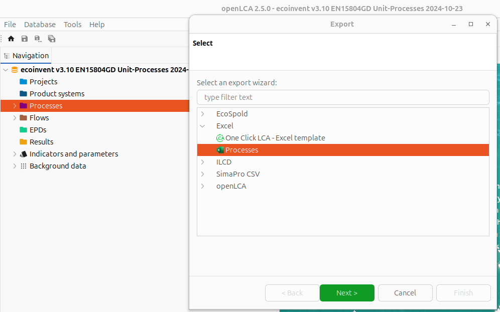
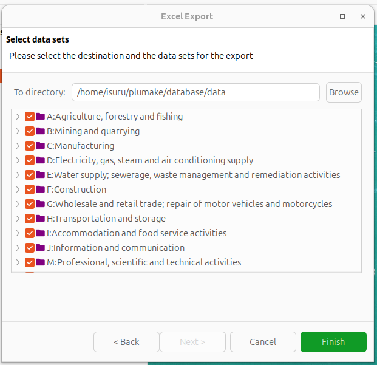
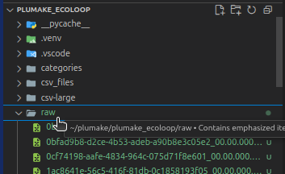

# plumake_ecoloop

Questo programma prende tutti i dati OpenLCA e converte a CSV e popola tutti dati ad un postgresql database

sviluppato da Isuru Fernando e Walid Jebali

## Instruzioni

-  [Installare OpenLCA](#installare-openlca-sul-linux)
-  [Creare virtual env per python](#creare-virtual-machine)
-  [Installare tutte le dipendenze e librerie python](#installare-dipendenze)
-  [Installare il database postgresql e creare le tabelle di arrivo](#installazione-postgresql)
-  [Importare ed esportare i database ecoinvent e agribalyse in openLCA](#importare-ed-esportare-i-database-ecoinvent-e-agribalyse-in-openlca)
-  [Esportare i csv](#esportare-i-csv)
-  [Lanciare lo script che esegue i calcoli e salva i risultati sul database](#lanciare-lo-script-che-esegue-i-calcoli-e-salva-i-risultati-sul-database)

### Installare OpenLCA sul Linux

Scarica tar.gz: [link](https://www.openlca.org/download/)

> nome file scaricato può essere non simile a quello che vedi sul commando e
> devi entrare sulla cartella dove hai scaricato prima di eseguire il comando

```
tar -zxvf openLCA_mkl_Linux_x64_2.5.0_2025-06-16.tar.gz
```

Cambiare a posizione permenete

```
sudo mv ~/Downloads/openLCA /opt/openLCA
```

Aggiungere openLCA al path

```
echo 'export PATH=$PATH:/opt/openLCA' >> ~/.bashrc
source ~/.bashrc
```

### Importare ed esportare i database ecoinvent e agribalyse in openLCA

Apri openLCA

```
openLCA
```

Dopo aver aperto openLCA, andate sul file in alto sinistra. Premete e ci dovra essere scritto import. Lo premete vi comparirà una piccola finestrina con scritto file -> import -> file. Premete sul file e caricate file ecoinvent.zolca


Quando hai caricato vedrai database come sotto


Premete due volte su file che vi comparirà sul openLCA, dopo aver premuto vi comparirà usa schermata per update database. Premete su OK

Ripremete su file zolca vi comparirà delle cartelle, voi andate sul cartella process e premete tasto destro -> export, dopo vi comparirà una schermata per convertire tutti file in formato Excel.



Premete sul Next, vi comparirà una altra schermata che vi da la possibilità di decidere quale cartella vuoi convertire. Noi nel nostro caso convertiamo tutti🤯💥.

Dopo aver selezionato tutte le cartelle da convertire, dovete premere su Browse per dove vuoi esportare


Poi premete finish e aspettate un pò


> Più il file lungo più ci mette tanto a convertire. Nell nostro caso ci e voluto 3 ore

### Creare virtual machine

#### in Linux

```
python3 -m venv .venv
```

#### attivare virtual machine

```
source .venv/bin/activate
```

### Installare dipendenze

> Devi attivare virtual machine prima di installazione dipendenze

```
pip install -r requirements.txt
```

### Installazione Postgresql

```
apt install postgresql
```

Automizzare configurazione repository

```
sudo apt install -y postgresql-common
sudo /usr/share/postgresql-common/pgdg/apt.postgresql.org.sh
```

per più dettagli: [link](https://www.postgresql.org/download/linux/ubuntu/)

### Esportare i csv

Dovete portare tutti i file Excel esportati da OpenLCA al cartella `raw` che si trova sulla programma



Per convertire esegui commando sotto

> ! Importante eseguire commando nel virual machine: [come attivare virtual machine](#attivare-virtual-machine)

```
python csv_converter.py
```

Una volta eseguito commando i file viene convertito sulla cartella `csv_files`

per una migliore esperienza visiva vi consiglio di installare estenzione `csv` da `Seamlessly Display and Edit CSVs`


Controlla struttura dei CSV file sono seguito la struttura qui sotto

```
UUID,
Name,
Category,
Description,
Version,
Tags,
Valid from,
Valid until,
Location,
Flow schema
```

### Lanciare lo script che esegue i calcoli e salva i risultati sul database


