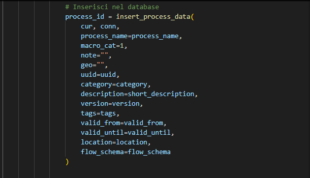

# plumake_ecoloop

Questo programma prende tutti i dati OpenLCA e converte a CSV e popola tutti dati ad un postgresql database

sviluppato da Isuru Fernando e Walid Jebali

## Instruzioni

-  [Installare OpenLCA](#installare-openlca-sul-linux)
-  [Creare virtual env per python](#creare-virtual-machine)
-  [Installare tutte le dipendenze e librerie python](#installare-dipendenze)
-  [Installare il database postgresql e creare le tabelle di arrivo](#installazione-postgresql)
-  [Importare ed esportare i database ecoinvent e agribalyse in openLCA](#importare-ed-esportare-i-database-ecoinvent-e-agribalyse-in-openlca)
-  [Esportare i csv](#esportare-i-csv)
-  [Lanciare lo script che esegue i calcoli e salva i risultati sul database](#lanciare-lo-script-che-esegue-i-calcoli-e-salva-i-risultati-sul-database)


### Installare OpenLCA sul windows 11

https://www.openlca.org/download/

### Installare postgresSQL sul windows 11

https://www.postgresql.org/download/


### Installare OpenLCA sul Linux

Scarica tar.gz: [link](https://www.openlca.org/download/)

> nome file scaricato può essere non simile a quello che vedi sul commando e
> devi entrare sulla cartella dove hai scaricato prima di eseguire il comando

```
tar -zxvf openLCA_mkl_Linux_x64_2.5.0_2025-06-16.tar.gz
```

Cambiare a posizione permenete

```
sudo mv ~/Downloads/openLCA /opt/openLCA
```

Aggiungere openLCA al path

```
echo 'export PATH=$PATH:/opt/openLCA' >> ~/.bashrc
source ~/.bashrc
```

### Importare ed esportare i database ecoinvent e agribalyse in openLCA

Apri openLCA

```
openLCA
```

Dopo aver aperto openLCA, andate sul file in alto sinistra. Premete e ci dovra essere scritto import. Lo premete vi comparirà una piccola finestrina con scritto file -> import -> file. Premete sul file e caricate file ecoinvent.zolca


Quando hai caricato vedrai database come sotto


Premete due volte su file che vi comparirà sul openLCA, dopo aver premuto vi comparirà usa schermata per update database. Premete su OK

Ripremete su file zolca del database vi comparirà delle cartelle.


Ricordatevi di tenere aperto Visual Studio Code, perché ci servirà tra poco, dopo che vi avrò spiegato due cosette.


### Creare virtual machin

#### in Linux/windows 

```
python3 -m venv .venv
```
### per windows
```
python -m venv .venv
```

#### Virtual environment 
Potete tranquillamente aprire Visual Studio Code e avviare il terminale.

```
source .venv/bin/activate
```
### per windows
```
./venv/bin/activate
```

### Installare dipendenze

> Devi attivare Virtual environment prima di installazione dipendenze

```
pip install -r requirements.txt
```
Se avete una versione di Ubuntu vecchia, come ad esempio la 20.04, potrebbe chiedervi di scaricare versioni diverse dei pacchetti indicati nel file requirements.txt. In questo caso, avete due opzioni: cercare su un motore di ricerca...


### Installazione Postgresql per linux
 
```
apt install postgresql
```

Automizzare configurazione repository

```
sudo apt install -y postgresql-common
sudo /usr/share/postgresql-common/pgdg/apt.postgresql.org.sh
```

per più dettagli: [link](https://www.postgresql.org/download/linux/ubuntu/)

Vi ricordo che, prima di avviare il programma da Visual Studio Code, dovete configurare correttamente PostgreSQL. In che senso? Significa che dovete aver impostato la password, il nome utente, il nome del database e tutti gli altri parametri necessari alla connessione. 


Se avete già impostato il nome utente, la password, il nome del database, l’host e la porta, allora siete pronti.


come vedette nell imagine io ho messo questi datti che sarebero del mio data base.

Vi starete chiedendo come fa il programma a prendere i dati da OpenLCA e inserirli nel database. Ve lo spiego subito: per prima cosa bisogna attivare la porta di comunicazione di OpenLCA. Come si fa? Nell’immagine qui sotto è tutto spiegato chiaramente.


Premete su IPC server e si aprirà una piccola schermata con la porta di OpenLCA, che di default è 8080.


per farlo partire premette sul coso verde e cosi ve lo fa partire.

Bene, ora la porta di OpenLCA è aperta, tranquilli. Nel programma è già presente il comando per collegarsi a OpenLCA tramite la sua porta, quindi non dovete fare nulla.


Poi, dopo aver fatto tutto su OpenLCA, andate su PostgreSQL/pgAdmin 4. Dopo esservi assicurati di aver avviato il server e inserito la password, vi comparirà la schermata come è successo a me.


Cosa fare dopo?
Andate sul nome del database. Se non lo avete ancora, vi basta crearlo: cliccate con il tasto destro su "Databases" e selezionate "Create > Database", poi inserite un nome e cliccate su Save.

Successivamente, cliccate di nuovo con il tasto destro sul database appena creato, selezionate "Create > Database" e inserite il nome esatto del database (nel nostro caso si chiama ecoloop_test).

Ricordatevi: assicuratevi di aver inserito correttamente tutti i parametri nel programma:

DB_NAME (nome del database)

DB_USER (nome utente)

HOST (indirizzo del server)

PASSWORD

Se anche solo uno di questi è sbagliato, il collegamento non funzionerà.


vi dovra apparire cosi.

Ora vi faccio vedere, prima di avviare il programma, da dove il programma prende i dati dei processi da OpenLCA, come li stampa nel terminale e poi li salva nel database.





Questo è il comando che permette al programma di prendere i dati, stamparli nel terminale, eseguire i calcoli e infine salvarli nel database.

Come facciamo a verificare se i dati sono stati effettivamente salvati nel database?
Per ora abbiamo impostato il programma per stampare solo 5 processi.

Vi faccio prima vedere cosa appare nel terminale e poi andiamo a controllare nel database.


questio e cio che mi mostra sul terminale.

poi per vedere sul database seguite le insicazione sulle imagini.


Andate sulla tabella tab_emission_factors, cliccate con il tasto destro e selezionate View/Edit Data. In questo modo vi comparirà la tabella con i risultati del calcolo.


Per vedere i dati dei processi, andate sulla tabella tab_process e ripetete gli stessi passaggi: cliccate con il tasto destro e selezionate View/Edit Data.


Per esportare i dati in formato CSV, cliccate con il tasto destro sulla tabella tab_process oppure tab_emission_factors, poi selezionate Import/Export Data.
Vi comparirà una schermata da cui potrete scegliere le opzioni di esportazione. 


Il programma vi genera automaticamente il file in formato CSV. A questo punto, cliccate su OK.

P.S.: Se volete, potete creare una vostra cartella personalizzata e salvare lì il file CSV.

Se volete visualizzare i dati del file CSV, vi consiglio di usare Visual Studio Code: spostate lì il file CSV e installate l’estensione che vedete nell’immagine.


per una migliore esperienza visiva vi consiglio di installare estenzione `csv` da `Seamlessly Display and Edit CSV


Se volete usare il database Agribalyse 3.2, seguite gli stessi passaggi che avete fatto per OpenLCA: andate su File > Import e caricate il file del database.

I passaggi per attivare la porta sono identici.

Attenzione: non è possibile avere due database attivi contemporaneamente su OpenLCA.
Questo significa che, se volete passare da Agribalyse a Ecoinvent, vi basta fare doppio clic su Ecoinvent: così facendo, il database Agribalyse verrà automaticamente disattivato.


poi prima di avviare il pogramma dovete modificare una picolla cosetta 


Dove è scritto 2, inserite 1 se state usando il database Ecoinvent; invece, se usate il database Agribalyse 3.2, lasciate 2 se ce DEFRA mettete 3.

Lo so, è un po' scomodo, ma vi consiglio di fare così per mantenere tutto più ordinato e chiaro.

ricordate per avviare il programma il comando e questo 

```
python calcolo.py
```